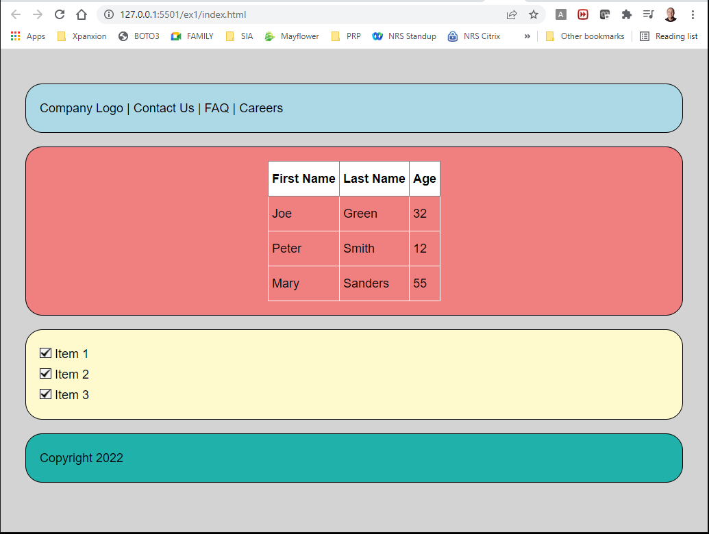
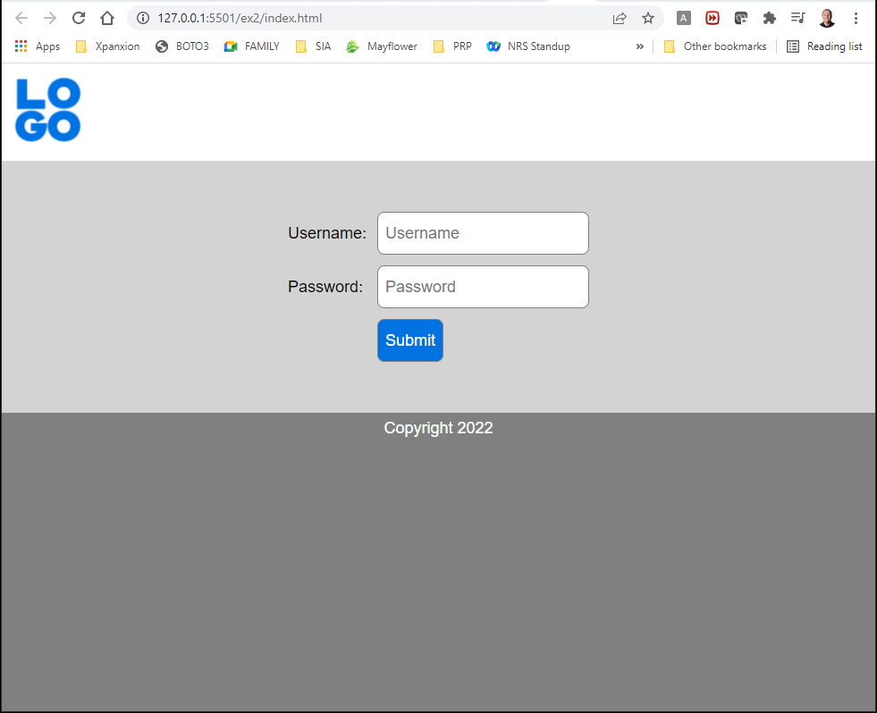

# HTML & CSS Assignments

# Ex. 1 
Create a webpage (`index.html`) and a css file (`style.css`) that resembles the following:

Colors:
- lightgray
- lightblue
- lightcoral
- lemonchiffon
- lightseagreen

# Ex. 2
Create a webpage (`index.html`) and a css file (`style.css`) that resembles the following:

Colors:
- white
- gray
- lightgray
- #0072e1 (blue)

The logo image is located in `images/logo.png`.

# Ex. 3
Create a webpage (`index.html`) and a css file (`style.css`) that resembles the following:

Colors:
- #ffcdd2
- #d83519
- #2941ab
- #1ed760

The logo image is located in `images/spotify-logo.png`.

# Ex. 4
Create a webpage (`index.html`) and a css file (`style.css`) that resembles the following:

# Ex. 5

Create a webpage (`index.html`) and a css file (`style.css`) that resembles the following:

